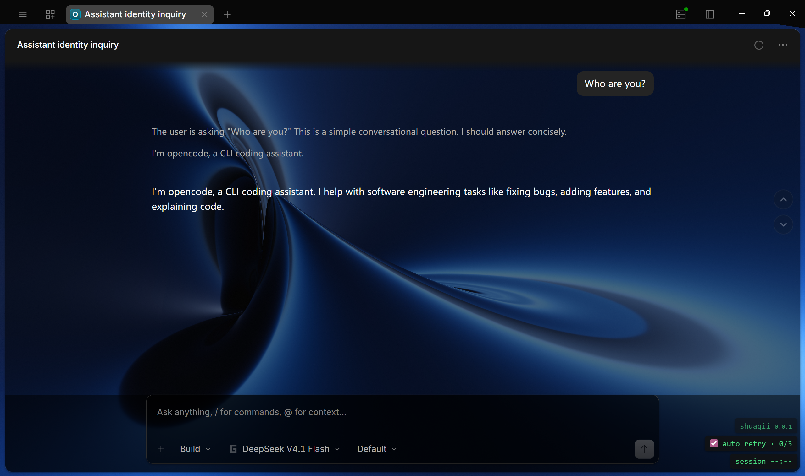
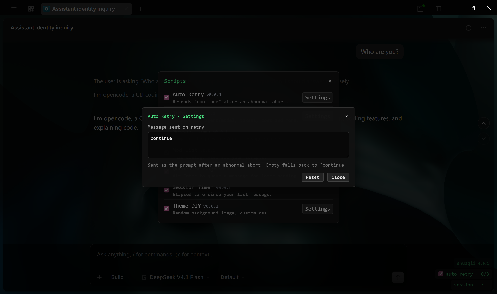
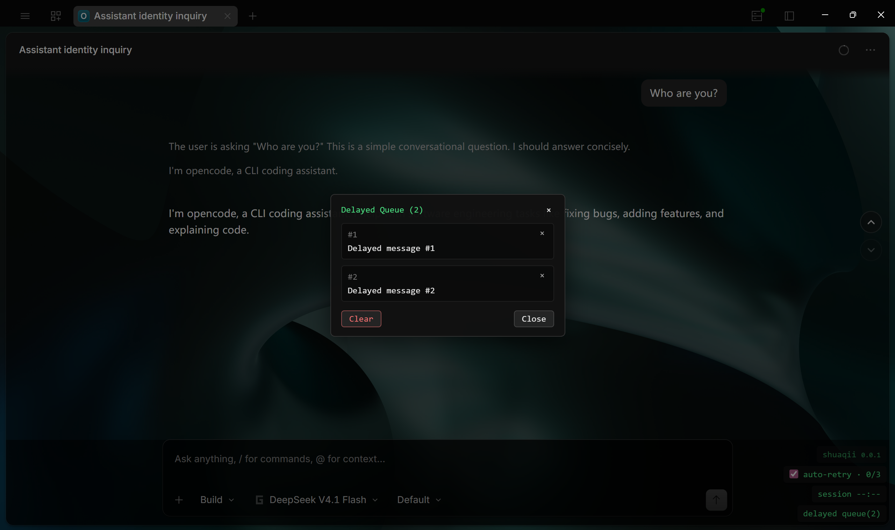

# shuaqii

A script loader for OpenCode Desktop, plus a collection of built-in scripts.

`shuaqii.py` is a dependency-free Chrome DevTools Protocol (CDP) client. It attaches to
the OpenCode Desktop renderer, injects your JavaScript into it, and keeps it there —
watching your files and re-injecting on every save, and surviving page reloads. The
`scripts/` directory holds a set of small scripts that run on top of it.

## What it is

- **The loader** — `shuaqii.py`, pure Python standard library. It can launch OpenCode
  Desktop with a remote debugging port, attach to every injectable renderer target, run
  your code in each, and re-inject automatically when the page reloads or a file changes.
  It works on any Electron app you can start with `--remote-debugging-port=<n>`.
- **The built-in scripts** — `scripts/*.js`, a set of scripts (session timer, auto retry,
  delayed queue, info HUD, message jump, theme DIY, and the script list itself) built on a
  shared bottom-right overlay and a shared service layer, `scripts/core.js`.

## Requirements

- **Windows** for auto-launch and `--restart` (the app paths probed by `--launch` are
  Windows locations). The injector core itself only needs Python 3 + an Electron app
  started with a remote debugging port, so the CDP half is portable.
- **Python 3** — no `pip install`; standard library only.
- **OpenCode Desktop** installed, or pass `--launch <path/to/app.exe>`.

## Quickstart

Run this from an **external terminal** (not from inside OpenCode Desktop):

```powershell
python shuaqii.py
```

With no arguments, and `.js` files present in `scripts/`, a bare run:

1. launches OpenCode Desktop with `--remote-debugging-port=9222`, restarting any running
   instance,
2. auto-loads every `scripts/*.js` in order (`core.js` first),
3. watches `scripts/` and re-injects when a file changes, is added, or is removed.

When the app comes up you get a bottom-right overlay headed `shuaqii <version>`. Click
that header to open the **script list** and turn individual scripts on or off (the choice is
remembered in `localStorage`).

> **Do not run the restarting form from inside OpenCode Desktop.** `python shuaqii.py`
> (and `--restart`) kills the running app first — including the host of your current
> session. Use an external terminal.

### Already running with a debug port

If OpenCode Desktop was launched separately with `--remote-debugging-port`, attach
without restarting it by passing any flag, e.g.:

```powershell
python shuaqii.py --live     # auto-load + watch scripts/, no relaunch
python shuaqii.py --list     # list debug targets ("*" = injectable), then exit
```

## Built-in scripts

These live in `scripts/` and are managed from the overlay's script list:

| Mod                | What it does                                                                              | Default            |
| ------------------ | ----------------------------------------------------------------------------------------- | ------------------ |
| **Session Timer**  | Shows elapsed time since your last message.                                               | On                 |
| **Auto Retry**     | Resends `"continue"` after an abnormal abort; stops after 3 in a row.                     | On                 |
| **Queued Message** | Alt+Enter (or Alt+click send) queues a message; it auto-sends when the session goes idle. | On                 |
| **Mod List**       | The enable/disable dialog behind the `shuaqii` title.                                     | Always on (locked) |
| **Info HUD**       | Grid of session facts: id, agent/model, tokens, cost, changed files, and more.            | Off                |
| **Message Jump**   | Up/down buttons to jump between the messages you sent.                                    | Off                |
| **Theme DIY**      | Random `theme-diy/bg/` background per session, with opacity + extra CSS.                  | Off                |
| **Keep Awake**     | Holds an Electron power blocker while a session runs, so the machine won't sleep.         | On                 |





## Writing your own script

Drop a file in `scripts/` and it is picked up by auto-load. Scripts run inside the
renderer's page context, zero dependencies, as an async IIFE. Register with `core.js`
instead of managing your own lifetime:

```js
(async () => {
  const sq = window.__sq;
  const reg = window.__sqScripts;          // registry, owned by core.js
  if (!sq || !reg) return;                 // core.js must be injected first
  await sq.ready;                          // server/auth/windowID resolved

  const ID = "my-feature";
  let active = false;
  let unsubscribe = null;

  function mount() {
    active = true;
    unsubscribe = sq.every(1000, () => {   // shared ticker, not setInterval
      if (active) window.__sqOverlay.set(ID, "my-feature");
    });
  }

  function unmount() {
    active = false;
    if (unsubscribe) { unsubscribe(); unsubscribe = null; }
    window.__sqOverlay.remove(ID);
  }

  reg.register(ID, { label: "My Feature", mount, unmount });
})();
```

`register(id, { label, version, order, locked, enabled, actions, mount, unmount })` is
idempotent: re-injecting calls the previous instance's `unmount()` first, so re-running
your file on save is safe. Overlay lines are keyed by id, so re-injection **replaces** a
line rather than duplicating it. Each injection pass is stamped with a fresh id and
`sweep()` evicts entries left over from earlier passes, so **deleting a file from
`scripts/` unmounts it** (line, timers and all) instead of leaving it running.

For the full API — overlay, registry, renderer services, message/error shapes, and the
live-app verification workflow — see
[`.opencode/skills/inject-script/SKILL.md`](.opencode/skills/inject-script/SKILL.md).

### Main-process scripts

A few things only exist in Electron's main process, not the renderer — `powerSaveBlocker`
(used by **Keep Awake**) is why a script can opt into it. Put the marker

```js
// @shuaqii:main
```

anywhere in a `scripts/*.js` file and shuaqii injects **the same file** into both places,
through the Node inspector it opens with `--inspect=<port>`. The file branches on where it
is running, so one file can hold both halves:

```js
(function () {
  if (typeof window === "undefined") runMain();     // main process: plain Node context
  else runRenderer();                               // renderer: window.__sq, overlay, registry
})();
```

Main scripts run in a plain Node context: there is no `window` (use `globalThis`), no
overlay, and no registry, but `require("electron")` is available. To hand data back to the
renderer, call `webContents.executeJavaScript`; **Keep Awake** publishes its state as
`window.__shuaqiiMain["keep-awake"]` for its own renderer half to display.

A bare `python shuaqii.py` (and `--launch`) passes `--inspect=9229` when it launches the
app, but OpenCode Desktop already opens a main-process inspector on `9229`, so attaching
to a running app works too. If the inspect port is unreachable shuaqii warns once and runs
the renderer half only. Use `--inspect-port N` for a different port, or
`--main <file>` to send one file to the main process without editing it.

There is no `ipcRenderer` in the page (OpenCode Desktop runs a context-isolated renderer),
so renderer↔main messaging uses other channels. **Keep Awake** demonstrates both
directions: the main half hosts a tiny CORS-open localhost HTTP server on an ephemeral
port (published to the page together with a per-run token) that the renderer half POSTs its
enabled state to — including a `sendBeacon` on disable, so turning the mod off releases the
blocker immediately — and pushes status back the other way with
`webContents.executeJavaScript`.

## `shuaqii.py` CLI reference

| Flag                | Description                                                                 |
| ------------------- | --------------------------------------------------------------------------- |
| `-s, --script FILE` | JS file to inject (repeatable; order preserved).                            |
| `-e, --eval CODE`   | Inline JS to inject (repeatable).                                           |
| `--main FILE`       | JS file to inject into the Electron main process (repeatable; needs `--inspect`). |
| `--inspect-port N`  | Main-process Node inspect port (default `9229`).                            |
| `-i, --interactive` | Read JS from stdin and run it in every window.                              |
| `--live`            | Watch `-s` files and re-inject on save (hot reload).                        |
| `-w, --watch`       | Keep running and inject into new windows.                                   |
| `-t, --timeout SEC` | Stop after N seconds.                                                       |
| `-l, --list`        | List debug targets and exit.                                                |
| `--launch [EXE]`    | Launch the app with the debug port (auto-detects OpenCode Desktop).         |
| `--restart`         | **DANGER:** kill the running app before `--launch`. External terminal only. |
| `--isolated`        | Launch a separate debug copy with its own `--user-data-dir` (see limits).   |
| `--wait SEC`        | Seconds to wait for the debug port after `--launch` (default 25).           |
| `-p, --port N`      | Remote debugging port (default `9222`).                                     |
| `-H, --host H`      | Debug host (default `127.0.0.1`).                                           |
| `-u, --url REGEX`   | Only inject targets whose URL matches.                                      |
| `-V, --version`     | Print the version.                                                          |

If neither `-s` nor `-e` is given, every `.js` in `scripts/` is loaded automatically
(`core.js` first) and the directory is watched.

## How it works

1. **Attach** — queries `http://<host>:<port>/json/list` and opens a WebSocket to each
   injectable `page`/`webview` target, skipping `devtools://`, `chrome://`,
   `chrome-extension://`, `chrome-untrusted://`, `edge://`, and `about:` URLs.
2. **Inject** — evaluates a version bootstrap, then each script in order via
   `Runtime.evaluate`. Exceptions from a script are logged, not fatal.
3. **Keep it there** — the bootstrap sets `window.__shuaqii.injected`, which lives only as
   long as the page context. A watching injector probes that marker and re-injects into any
   target whose context was replaced (e.g. the app's Reload).
4. **React** — `--live` / auto-load re-injects on file changes (and on added/removed
   files); `-i` evaluates what you type in every window. Polling backs off to 2s when idle.
5. **Stop cleanly** — if the debug port disappears, the app is presumed exited and the
   injector stops after a short grace period.

## Footguns & limits

- **Single-instance lock.** OpenCode Desktop hardcodes its `userData` path and holds a
  single-instance lock, so `--user-data-dir` / `--isolated` are ignored. The only way to
  attach is to start it with `--remote-debugging-port=<n>` while **no other instance is
  running**.
- **`--restart` is fatal to the host.** If you are running inside OpenCode Desktop, never
  `taskkill` it — you kill your own host/session. Use an external terminal.
- **Renderer reloads wipe the injection.** Ctrl+F5, the app's Reload, or
  `location.reload()` clears our context. A watching injector (auto-load, `--live`,
  `--watch`, `-i`) re-injects automatically; a one-shot `-s`/`-e` run exits and must be
  re-run.

## Repository layout

```text
shuaqii.py                     the CDP injector (stdlib only)
scripts/                       bundled scripts, auto-loaded
  core.js                      overlay + shared services + script registry
  mod-list.js                  enable/disable UI (behind the overlay title)
  session-timer.js
  auto-retry.js
  queued-message.js
  message-jump.js
  info-hud.js
  theme-diy.js
  keep-awake.js                also opts into the main process (see the marker below)
examples/
  sample-patch.js              minimal injection example
theme-diy/bg/                  background images used by Theme DIY
.opencode/skills/inject-script/SKILL.md   developer reference for injection scripts
```

## License

MIT — see [LICENSE](LICENSE).
